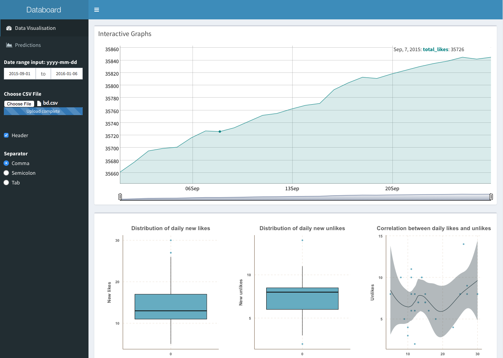
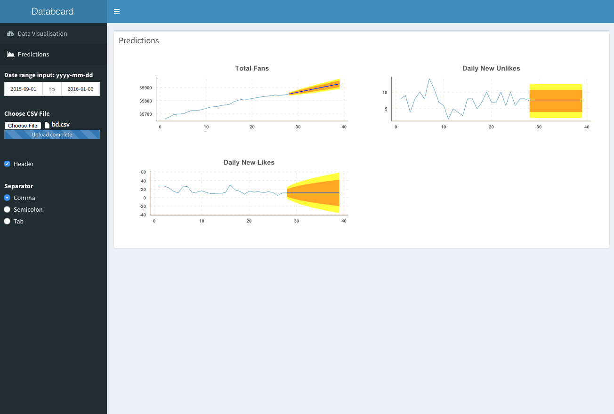

# Databoard
## Facebook insights analysis, visualisation and prediction

### Installation instructions

```r
# for installing from github, compiling from source etc.
install.packages("devtools")

# load the library
library(devtools)

# just development version works at this point
devtools::install_github('ggthemr', 'cttobin')

# all necessary packages to run the app
install.packages(c("shiny", "readr", "data.table", "dplyr", "tidyr", "ggplot2", "shinydashboard", "pacman", "marketeR", "forecast", "Rfacebook", "dygraphs"))
```

Screenshots:



